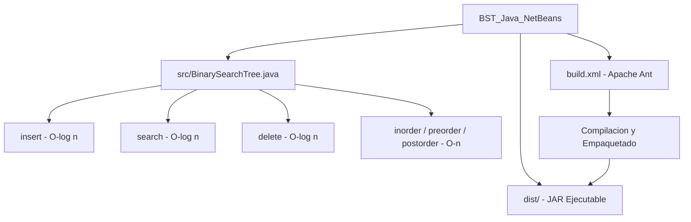

<div align="center">

# Árbol Binario de Búsqueda (BST) — Implementación en Java


> Implementación completa de árbol binario de búsqueda en Java con NetBeans/Ant: inserción, búsqueda, eliminación y recorridos.

## Descripción

</div>

---

Implementación de la estructura de datos **Binary Search Tree (BST)** en Java usando **NetBeans IDE** con sistema de build **Apache Ant**. Se implementan todas las operaciones fundamentales con análisis de su complejidad temporal en casos promedio y peor caso.

## Operaciones implementadas

| Operación | Complejidad Promedio | Complejidad Peor Caso |
|---|---|---|
| Inserción | O(log n) | O(n) árbol degenerado |
| Búsqueda | O(log n) | O(n) árbol degenerado |
| Eliminación | O(log n) | O(n) árbol degenerado |
| Recorrido inorden | O(n) | O(n) |
| Recorrido preorden | O(n) | O(n) |
| Recorrido postorden | O(n) | O(n) |

## Arquitectura



## Estructura del proyecto

```
proyecto/
├── src/               # Código fuente Java
├── build/             # Clases compiladas
├── dist/              # JAR ejecutable
├── build.xml          # Configuración Apache Ant
└── manifest.mf        # Manifiesto del JAR
```

## Contexto académico

**Asignatura:** Ingeniería de Software / Estructuras de Datos · **Institución:** Ingeniería Informática
**Autor:** Alejandro De Mendoza — Ingeniero Informático · Especialista Ingeniería de Software

---

## Autor

**Alejandro De Mendoza**  
Ingeniero Informático · Especialista en IA · Especialista en Ingeniería de Software · Máster en Arquitectura de Software

[](https://github.com/AlejoTechEngineer)
